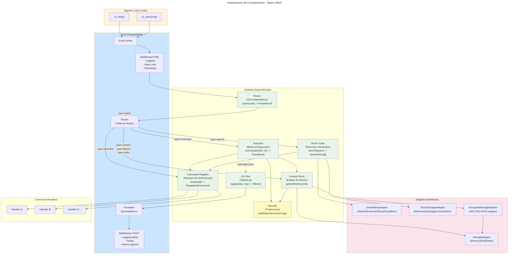
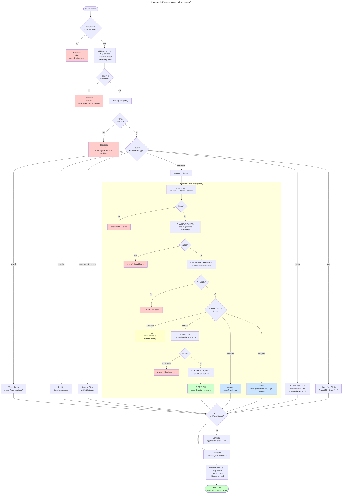
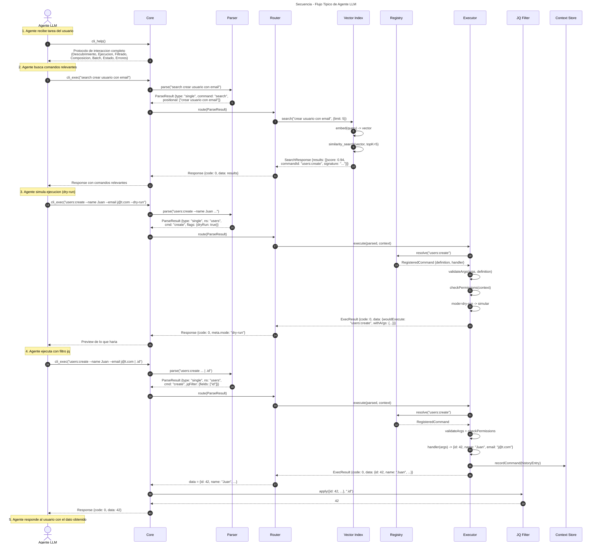
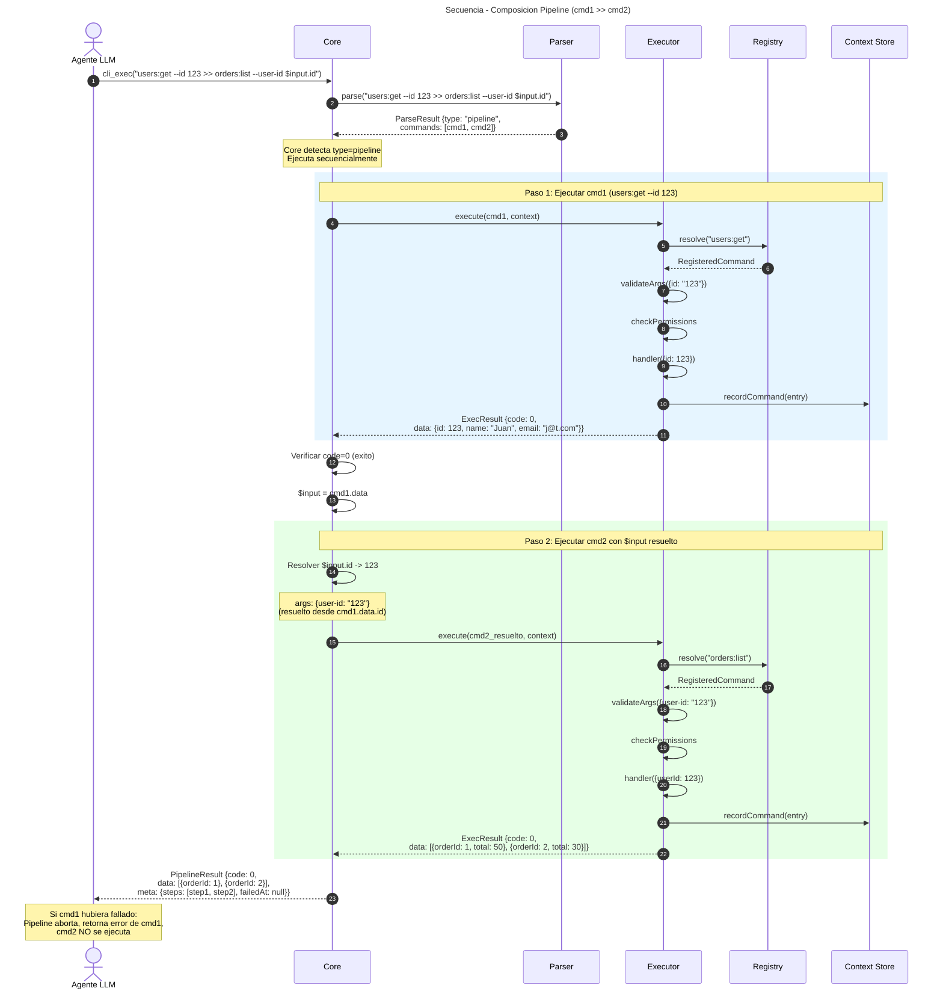
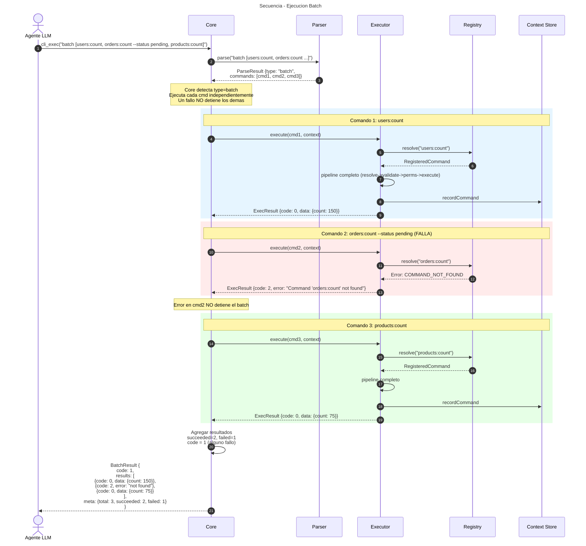
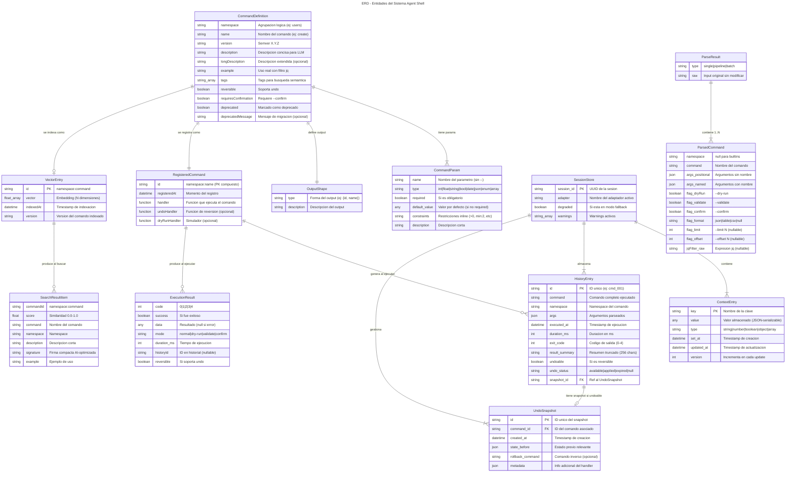

# Diagramas: Agent Shell v1.0

> Generados a partir de los contratos de especificacion del sistema.
> Fecha: 2026-01-22

## Indice

1. [Diagrama de Componentes](#1-diagrama-de-componentes)
2. [Flujo del Pipeline (cli_exec)](#2-flujo-del-pipeline-cli_exec)
3. [Secuencia: Flujo Tipico de Agente](#3-secuencia-flujo-tipico-de-agente)
4. [Secuencia: Composicion (cmd1 >> cmd2)](#4-secuencia-composicion-cmd1--cmd2)
5. [Secuencia: Flujo Batch](#5-secuencia-flujo-batch)
6. [Diagrama de Estados: Ejecucion de Comando](#6-diagrama-de-estados-ejecucion-de-comando)
7. [ERD: Entidades del Sistema](#7-erd-entidades-del-sistema)

---

## 1. Diagrama de Componentes

Muestra todos los modulos del sistema y sus relaciones de dependencia segun los contratos.



**Notas:**
- Core es el unico punto de entrada (2 entry points: `cli_help`, `cli_exec`)
- Parser es zero-dependency y stateless
- Vector Index depende de EmbeddingAdapter y VectorStorageAdapter (patron Strategy)
- Context Store es agnostico al backend via StorageAdapter
- El Executor consulta al Registry para resolver handlers y al Context Store para permisos/estado
- Security es transversal: el Executor usa audit logging y el Context Store usa secret detection
- EncryptedStorageAdapter envuelve cualquier StorageAdapter para encriptacion transparente
- JQ Filter opera post-ejecucion, antes del Formatter

---

## 2. Flujo del Pipeline (cli_exec)

Pipeline completo desde que el Core recibe `cli_exec("comando")` hasta la respuesta final.



**Notas:**
- Corresponde a la seccion 1.4 del contrato Core
- Los errores siempre se envuelven en Response estandar (nunca escapan sin formato)
- El JQ Filter se aplica sobre el data de cualquier subsistema, no solo del Executor
- Timeouts configurables por subsistema (Parser: 100ms, Search: 2000ms, Executor: 5000ms, JQ: 500ms)

---

## 3. Secuencia: Flujo Tipico de Agente

Flujo completo: help -> search -> dry-run -> exec con jq. Corresponde a la seccion "Flujo de Interaccion Tipico" del PRD.



**Notas:**
- El agente solo consume ~600 tokens constantes de definicion de tools
- El search vectorial permite descubrir cualquier comando sin listado previo
- El dry-run no registra en historial ni ejecuta el handler real
- El JQ Filter reduce los tokens de respuesta extrayendo solo el campo necesario

---

## 4. Secuencia: Composicion (cmd1 >> cmd2)

Flujo de composicion donde el output de un comando es input del siguiente. Definido en seccion 1.6 del contrato Executor.



**Notas:**
- Las referencias `$input.campo` se resuelven al valor del output del paso anterior
- Si un paso falla, el pipeline aborta inmediatamente (no hay rollback)
- Los flags globales del primer comando aplican a todo el pipeline (ej: --dry-run)
- Cada paso se registra en historial de forma independiente
- Profundidad maxima: 10 comandos encadenados

---

## 5. Secuencia: Flujo Batch

Ejecucion de multiples comandos independientes. Definido en seccion 1.7 del contrato Executor.



**Notas:**
- Los comandos batch son independientes (no comparten estado entre ellos)
- Un fallo en un comando NO aborta los demas (a diferencia del pipeline)
- El code final del BatchResult es 0 solo si TODOS fueron exitosos
- Cada comando se registra en historial individualmente
- Tamano maximo de batch: 50 comandos (contrato Core) / 20 (contrato Executor)
- Ejecucion secuencial en v1 (no paralelo)

---

## 6. Diagrama de Estados: Ejecucion de Comando

Ciclo de vida de un comando desde su ingreso hasta la respuesta. Basado en el pipeline de 7 pasos del contrato Executor.

```mermaid
---
title: Estados de Ejecucion de un Comando
---
stateDiagram-v2
    [*] --> Received: cli_exec(cmd)

    Received --> Parsing: Middleware PRE ok
    Received --> Rejected: Rate limit excedido (code=3)

    Parsing --> Parsed: Parser.parse() exitoso
    Parsing --> SyntaxError: Parser retorna ParseError (code=1)

    Parsed --> Routing: ParseResult valido

    Routing --> Resolving: type=command
    Routing --> Searching: type=search
    Routing --> ContextOp: type=context/history/undo
    Routing --> BatchProcessing: type=batch
    Routing --> PipeProcessing: type=pipe

    state ExecutorPipeline {
        Resolving --> Validating: Handler encontrado
        Resolving --> NotFound: Comando no existe (code=2)

        Validating --> CheckingPerms: Args validos
        Validating --> InvalidArgs: Args invalidos (code=1)

        CheckingPerms --> ApplyingMode: Permisos OK
        CheckingPerms --> Forbidden: Sin permisos (code=3)

        ApplyingMode --> ValidateMode: --validate
        ApplyingMode --> DryRunMode: --dry-run
        ApplyingMode --> ConfirmMode: --confirm
        ApplyingMode --> Executing: modo normal

        ValidateMode --> Success: data={valid: true}
        DryRunMode --> Success: data={wouldExecute, effect}
        ConfirmMode --> AwaitingConfirm: code=4, confirmToken

        Executing --> ExecutionSuccess: Handler retorna data
        Executing --> ExecutionTimeout: Timeout excedido (code=1)
        Executing --> HandlerError: Handler lanza error (code=1)

        ExecutionSuccess --> RecordingHistory: Persistir en historial
    end

    RecordingHistory --> Filtering: historyId asignado
    Searching --> Filtering: SearchResult[]
    ContextOp --> Filtering: ContextData
    BatchProcessing --> Filtering: BatchResult
    PipeProcessing --> Filtering: PipelineResult

    Filtering --> Formatting: jqFilter? apply()
    Filtering --> Formatting: sin filtro

    Formatting --> PostMiddleware: format aplicado

    PostMiddleware --> Success: Response construida

    AwaitingConfirm --> [*]: Agente decide confirmar o cancelar

    Success --> [*]: Response {code: 0, data, meta}
    Rejected --> [*]: Response {code: 3, error}
    SyntaxError --> [*]: Response {code: 1, error}
    NotFound --> [*]: Response {code: 2, error}
    InvalidArgs --> [*]: Response {code: 1, error}
    Forbidden --> [*]: Response {code: 3, error}
    ExecutionTimeout --> [*]: Response {code: 1, error}
    HandlerError --> [*]: Response {code: 1, error}

    note right of Received
        Cmd max: 4096 chars
        Rate limit: 120 req/min
    end note

    note right of Executing
        Timeout configurable
        Default: 30s (Executor)
    end note

    note right of RecordingHistory
        Solo en modo normal
        No en dry-run/validate/confirm
    end note

    note right of AwaitingConfirm
        Token TTL: 5 minutos
        Si expira -> code=2
    end note
```

**Notas:**
- Solo el modo "normal" registra en historial
- El estado AwaitingConfirm requiere una nueva llamada `cli_exec("confirm <token>")` para continuar
- Todos los estados terminales producen un Response estandar con codigo 0-4
- El timeout es configurable por subsistema

---

## 7. ERD: Entidades del Sistema

Entidades principales definidas en los contratos: CommandDefinition, HistoryEntry, ContextEntry, UndoSnapshot, SearchResult.



**Notas:**
- CommandDefinition es la entidad central que alimenta tanto al Vector Index (discovery) como al Executor (ejecucion)
- HistoryEntry y UndoSnapshot estan en el Context Store, gestionados por sesion
- SearchResultItem es una proyeccion de VectorEntry + CommandMetadata, no se persiste
- ExecutionResult es efimero (se retorna al agente, no se almacena directamente)
- ParseResult/ParsedCommand son estructuras transitorias del pipeline

---

## Resumen de Interfaces Clave

| Modulo | Interface Principal | Contrato |
|--------|--------------------| ---------|
| Core | `help(): string`, `exec(cmd): Response` | core.md |
| Parser | `parse(cmd): ParseResult \| ParseError` | parser.md |
| Registry | `register(def, handler)`, `resolve(id)`, `toCompactText(def)` | command-registry.md |
| Vector Index | `search()`, `indexCommand()`, `indexBatch()`, `sync()` | vector-index.md |
| Executor | `execute()`, `confirm()`, `revokeConfirm()`, `undo()` | executor.md |
| JQ Filter | `applyFilter(data, expression): FilterResult` | jq-filter.md |
| Context Store | `get()`, `set()`, `getAll()`, `recordCommand()`, `undo()` | context-store.md |
| Security | `AuditLogger`, `RBAC`, `maskSecrets()`, `containsSecret()` | security.md |

---

## Convenciones de los Diagramas

| Color | Significado |
|-------|-------------|
| Verde claro (`#ccffcc` / `#e8f5e9`) | Exito, modulos especializados |
| Rojo claro (`#ffcccc` / `rgb(255,235,235)`) | Errores, fallos |
| Azul claro (`#cce5ff` / `rgb(230,245,255)`) | Info, modos especiales |
| Amarillo claro (`#ffffcc`) | Requiere atencion (confirm) |
| Naranja claro (`#fff3e0`) | Agente externo |
| Rosa claro (`#fce4ec`) | Adapters/interfaces externas |
